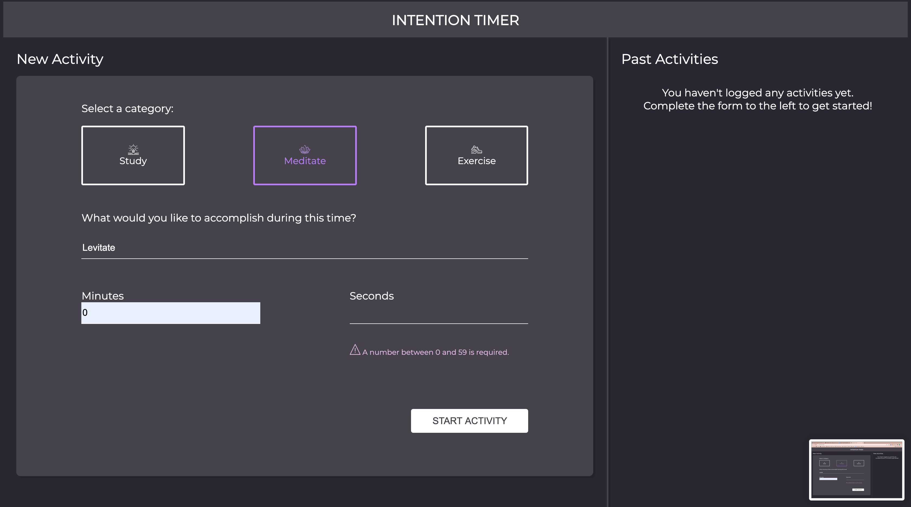
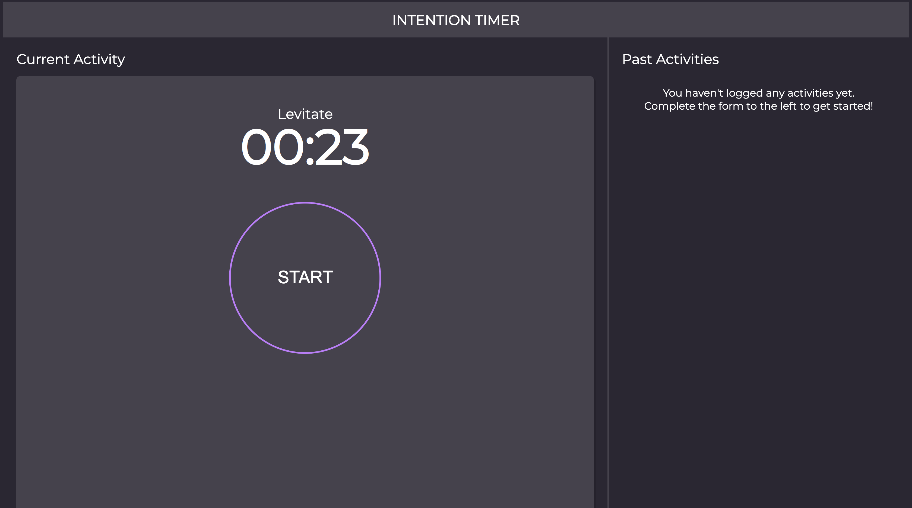
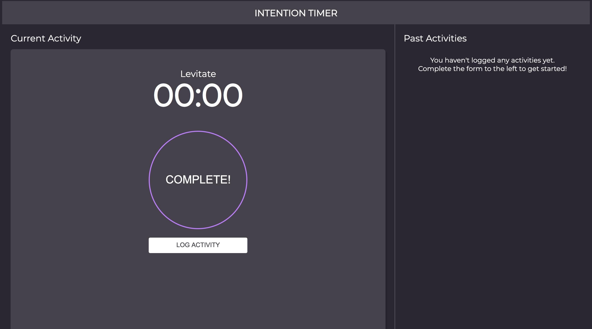
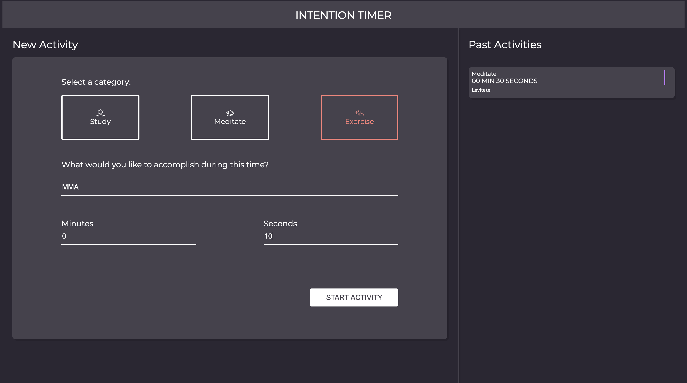
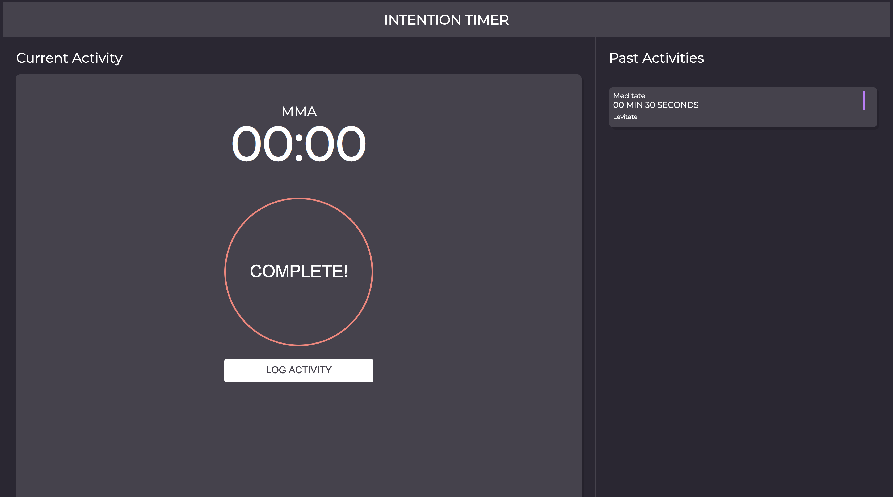
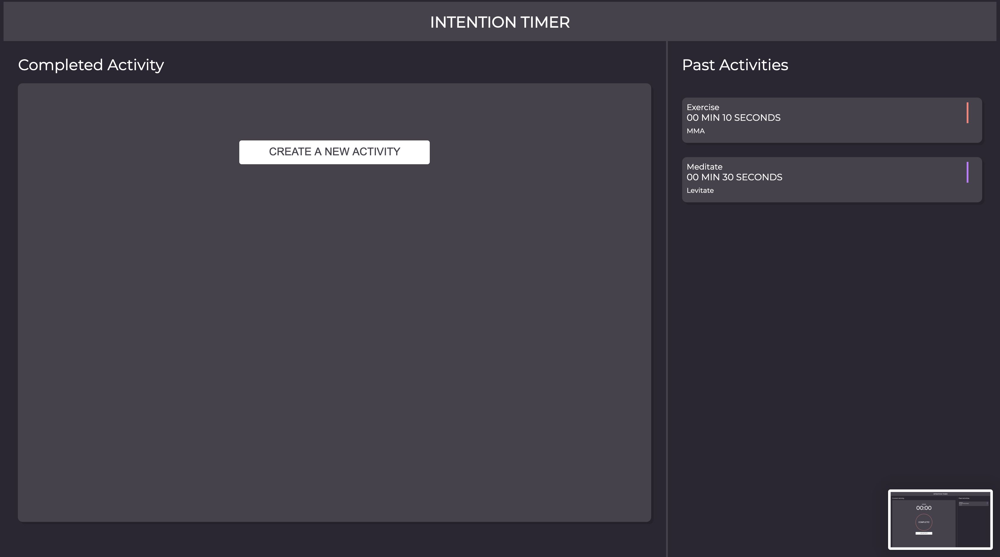
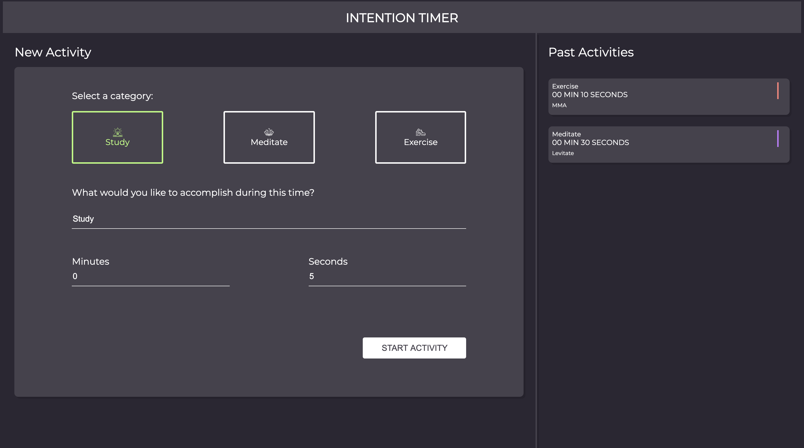
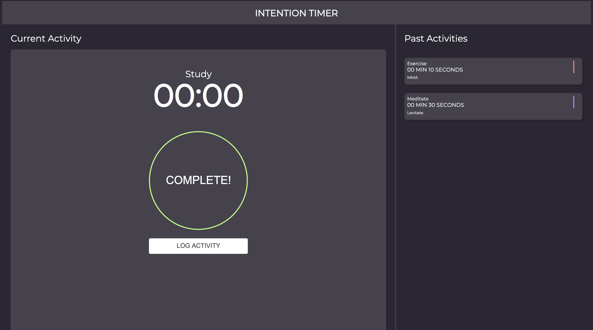
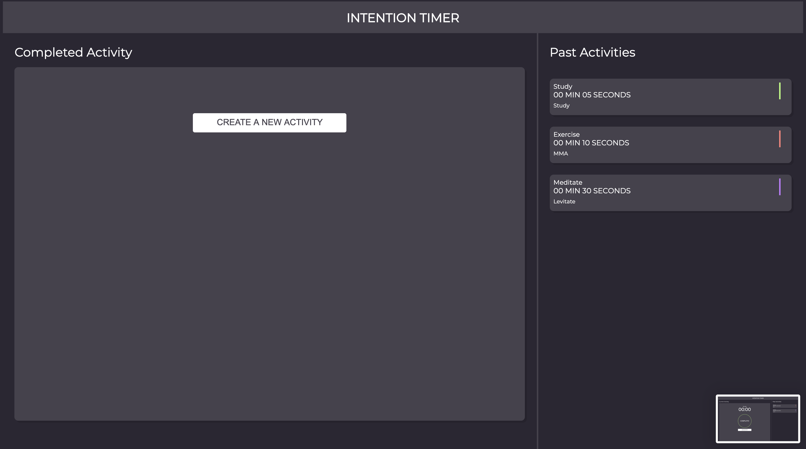

# Intention Timer
### Developers ::
- [Bruce Gordon](https://github.com/bruce-gordon)
- [Joe Lopez](https://github.com/Codo-Baggins)
- [Demaceo Howard](https://github.com/Hdemaceo)
### Project Links ::
- [Repo](https://github.com/Hdemaceo/intention-timer)
- [Deployed Page](https://hdemaceo.github.io/intention-timer/)
## Set-up ::
- Create repository and clone to personal computer
- Open in text editor
- Read the README.md
- In terminal, run command "open index.html" to interact with app.
## Overview & Learning Goals ::
For our Mod 1 group project, Intention Timer, we've been given a repository as well as a basic HTML layout to work on. The intended goal is to create an application with operational functionality according to the rubric and provided composition.

Our learning goals are to…

## Progression ::
9/8: Completed DTR, made GitHub repository, and familiarized ourselves with the given rubric. We then began constructing and designing our application as outlined in Iteration 0 within the rubric. Once that was completed, we moved onto Iteration 1 by creating an Activity class with a set of properties and methods to be utilized in future iterations of the project. We then made some progress on Iteration 2. The first goal of Iteration 2 is to provide specific functionality for when the “study”, “meditate” and “exercise” activities are clicked.
9/9: Tightened up some of our styling to make the app match the Comp more closely. We began giving functionality to the app to capture information from the input fields and eventually display it on the countdown timer page.  
9/10: Today we finished up Iteration 2 by creating fail-safes to prevent users from inputting information that is not relevant to the app.  We designed it so that error messages will appear if a user attempts to advance onto the timer page while a field is incorrectly entered.  The error messages then disappear once acceptable information is reentered into those input fields.  In addition, we tidied up some more CSS stylings.  
9/11: Built a functioning countdown timer that used the captured time entered by the user on the previous page as the initial time to countdown from. More refactoring and tidying to finish up Iteration 3.
9/12: Began working on Iteration 4.  Layed out a plan of attack and started creating features to allow activities to be logged after the timer hit 0.  Started prepping styling for the “logged activities section.”  
9/13: On this day, we rested.
9/14: Finished up Iteration 4.  Established ability to log multiple events and have those events be displayed in the “logged activity section.”  Made the page prettier.
9/15: Started and finished Iteration 5. Created functionality to locally save logged activities.  Ensured that those logged activities would persist if the page was closed and then reopened again. More refactoring to cut down on “WET” and confusing code.  
9/16: Refactor, refactor, refactor.  Removed unused and commented out code.  

## Showcase ::

New Activity page 
 

New Activity page: displaying "Warning Message" underneath invalid "Seconds" input 
 

Current Activity page: displaying user input with color coordinated Start button 
 

Current Activity page: displaying active start timer of minutes and seconds 
 

Current Activity page: displaying once the user input time has reached 00:00 
 

Completed Activity page: displaying updated Past Activities section with recent logged activity, as well as a "Create A New Activity" button 
 

New Current Activity page: (displayed after clicking "Create A New Activity" button) with new user activity input fields 
 

Current Activity page: displaying completed activity 
 

Completed Activity page: displaying updated Past Activities section 
 

New Current Activity page: displaying new user activity input fields 
 

Current Activity page: displaying completed activity 
 

Completed Activity page: displaying updated Past Activities section 
 

Project spec & rubric can be found [here](https://frontend.turing.io/projects/module-1/intention-timer-group.html).
